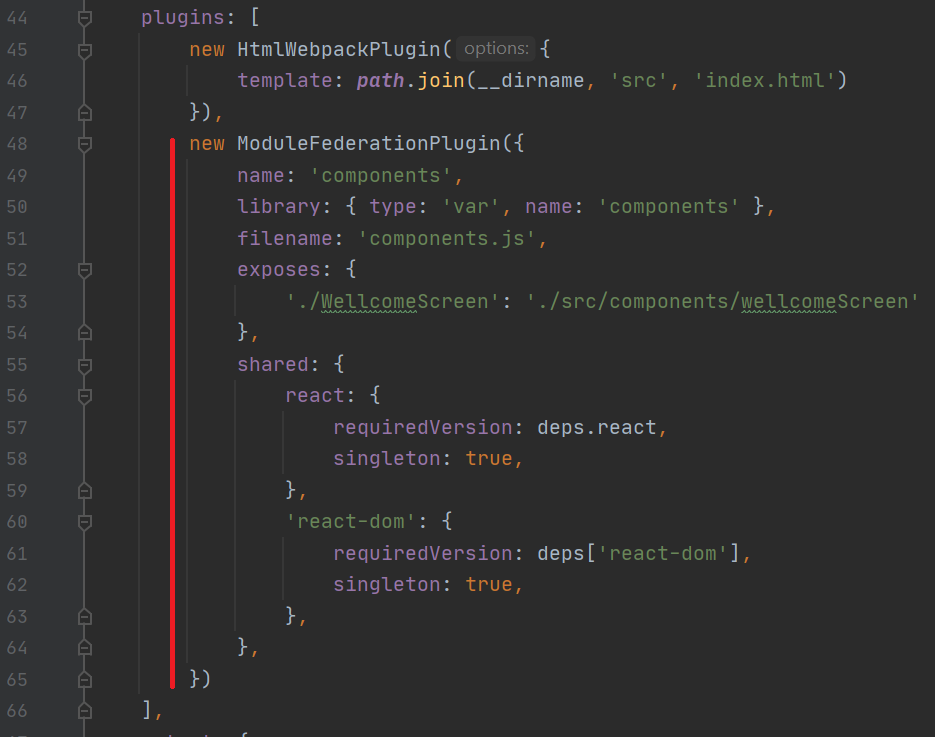
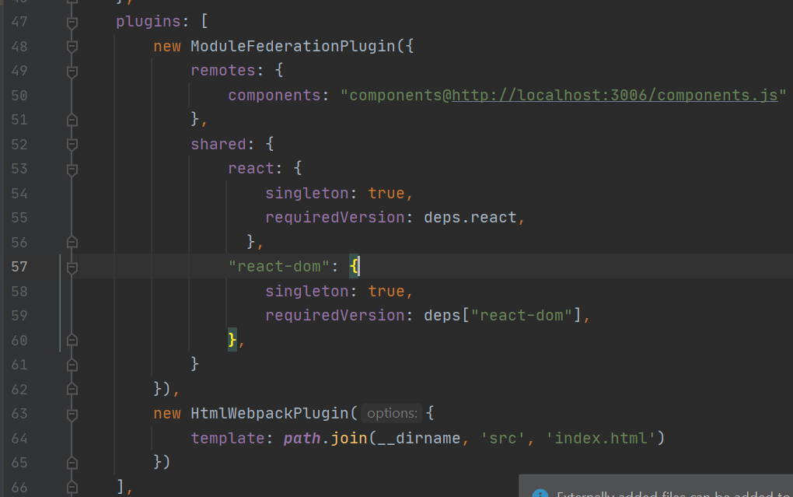

*** npm init ***

npm install -D webpack webpack-cli

создаем webpack.config.js
index.js
index.html

npm install -D style-loader less-loader css-loader file-loader

npm install -D html-webpack-plugin clean-webpack-plugin

npm install -D webpack-dev-server

## Module Federation ##

В конфигурационном файле экспортируемого модуля необходимо подключить плагин __ModuleFederationPlugin__ в котором прописываем свойства

`name: 'components'` - Наименование контейнера в котором расположены компоненты для экспорта.

`filename: 'components.js'` - Наименование файла JS  котором будет хранится.

`exposes: {'./WellcomeScreen': './src/components/wellcomeScreen'},` - по url './WellcomeScreen', будем получать компонент.
`shared` - должны быть одинаковые версии пакетов react, react-dom. 

Для использования микросервисов необходимо использовать ленивую загрузку (заимпортить новый файл `наример - bootstrap` в `index.js`, который будет выполнять действия уже ассинхронно)

В объекте `remotes:` в свойстве `components` указываем, что будет доступен контейнер `components` из файла `genbhttp://localhost:3006/components.js`
Далее указывается, что используется 1 версия реакта глобально во всем приложении.

Для импорта компонента в целевой используется метод `React.lazy`
<pre>const WellcomeScreen = React.lazy(() => import("components/WellcomeScreen"));</pre>

Важно сделать заглушку, на случай если экспортируемый сервис в данный момент недоступен. На примере `ErrorBoundary`